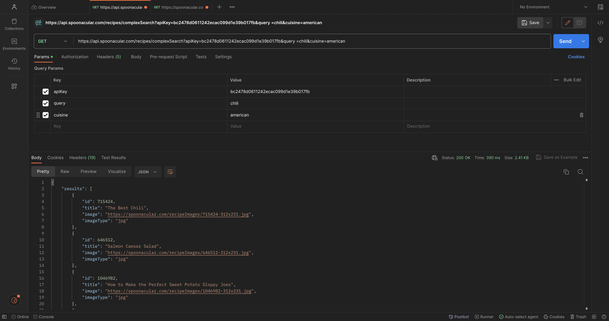
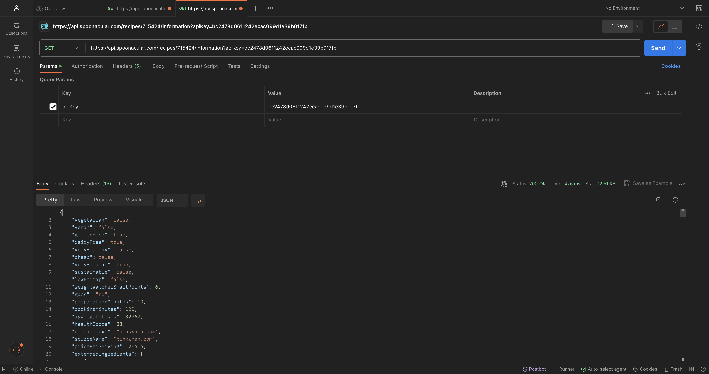

# Project Domain

> The project domain our team is tentatively focusing on is nutrition
> management and tracking. In a world where health conscious choices are
> paramount, finding a trusted source to navigate the sea of nutritional
> information can be quite daunting. By creating a Nutritional Tracking
> application our team will be able to deliver to our clients a way to
> navigate through the abundance of dietary data available online
> proving accuracy and transparency with every meal.

# Application Logistics

> Our team is thinking of developing an application that will help users
> to monitor their daily nutrient intake based on their personalized
> dietary goals (Such as to gain weight, lose weight, maintain weight).
> The application will also cater to various dietary restrictions and
> health conditions based on each user's input, and in return will be
> able to suggest personalized recommendations to assist them in
> achieving their goals. These recommendations will include certain
> foods and even recipes that can help the user achieve their personal
> nutritional goals.
>
> To deliver this application, our team will create an intuitive and
> user-centric interface. Users will first be able to create an account
> and then within the interface there will be options for users to input
> their dietary information, to set their personal goals, and to access
> recommendations by the application. The user will be able to adjust
> these manually but there will be presets in the case the user does
> not.

# API Usage

> Our team will utilize a food API (→ https://apilist.fun/api/food-api )
> that has access to over 330,000 recipes and 80,000 food products. The
> documentation for this API can be found →
> https://spoonacular.com/food-api/docs. Our team tried this API out in
> Postman by first obtaining an apiKey. With this, we were then able to
> make an API to get food items with chicken in them (As seen in figure
> 1). To get the recipes for these items we can simply choose the id of
> the food item we are interested in. For example, we can consider "The
> Best Chili" food item with the id "715424" and make another API call
> using the get recipe documentation to get the detailed recipe for the
> food item we chose (As seen in figure 2)

# Technical Problems

> One technical problem we ran into when using this API is that it has a
> paywall once a certain amount of requests are made. For this
> particular assignment it was not an issue. However, this is something
> to consider in the future since testing of a java application using
> this API may require more calls to be made.

# Java Code

> The java code provided in the Calling_API.java file shows a simple
> example of calling the API from java. The call within the code
> retrieves the data from an api call made on postman (see figure 3 below) to find a singular food item given a minimum sugar
> and minimum sodium parameter. The output from the java call can be seen in Figure 4.

# Figures

> Figure 1

> Figure 2

> Figure 3

